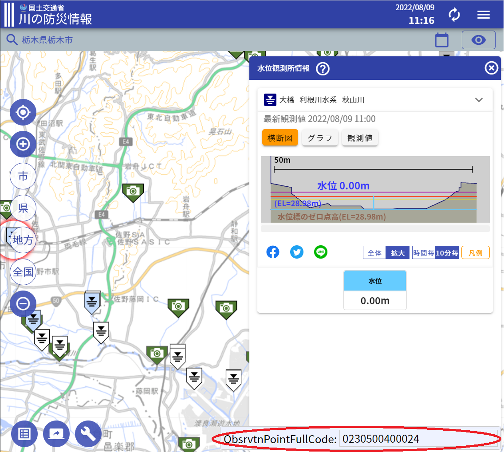

# ScriptAutoRunnerを使って国土交通省/川の防災情報にObsrvtnPointFullCodeを表示させる。

[川の防災情報](https://www.river.go.jp/kawabou
)



ScriptAutoRunnerの設定キャプチャ  


貼り付け用コード

タイトル:川の防災情報
```
// raw url
let gistScript = 'https://raw.githubusercontent.com/misaki-s/sar/main/river-go/sar.js';
fetch(gistScript).then((response) => response.text().then(cb));
function cb(retrievedText){
  eval(retrievedText);
}
```
雷雲アイコン（対象ホスト）: www.river.go.jp
